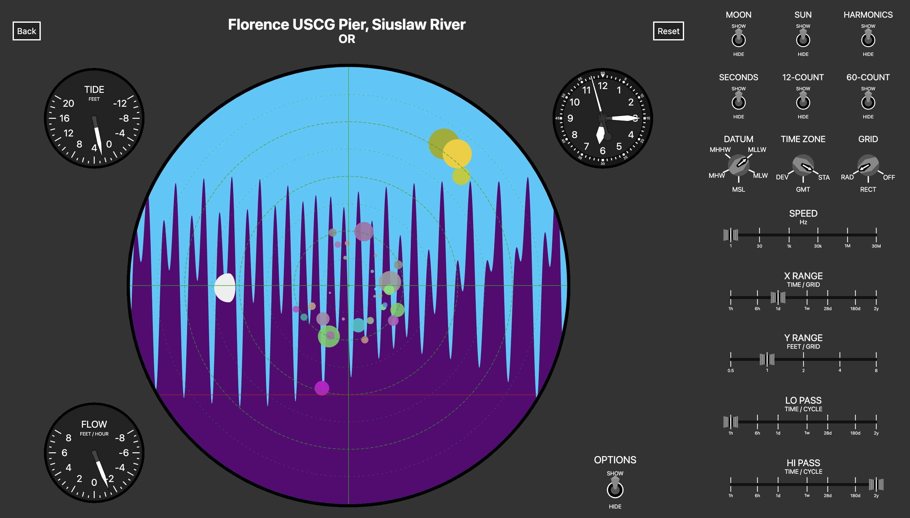

# solunar

## Works Cited

### Tide Logic

The core logic of this is a TypeScript implementation of the timeless _Manual of Harmonic Analysis and Prediction of Tides_, authored by Paul Schureman for the U.S. Department of Commerce as part of their Coast and Geodetic Survey, first published in 1924 and last modified in 1958. The full work is included here for reference (`Schureman1958.pdf`), or can be obtained [directly from NOAA](https://tidesandcurrents.noaa.gov/about_harmonic_constituents.html). All equations and other material derived from this manual are cited with the source page number as measured from the PDF for ease of reference (note: _not_ the internal page numberings).

The work _Computer Applications to Tides in the National Ocean Survey_ provides helpful extensions of core tables from Schureman into the modern era, which were consulted for verification of the code. This work can also be obtained from NOAA at the link above, or in this repository (`Zetler1982.pdf`).

Data for the Harmonic Constituents of all 1232 capable stations was obtained from the [NOAA Tides and Currents CO-OPS Metadata API](https://api.tidesandcurrents.noaa.gov/mdapi/prod/), and is included in the `data` directory for reference, along with the `data/scripts.hdnb` [Handy Dandy Notebook](https://marketplace.visualstudio.com/items?itemName=jakearl.handydandy-notebook) used for processing the data.

In short: Thanks NOAA!

### UI Styling

The UI is based (with varying degrees of roughness) on the F-15 Eagle's cockpit. Reference photos are kept in the `mood` directory, and were consulted during development. Thanks McDonnell Douglas!

Additional reference photos come from Will Wright’s "Antique Soviet Space Junk" collection, as discovered on [Don Hopkin's blog](https://donhopkins.medium.com/designing-user-interfaces-to-simulation-games-bd7a9d81e62d) Thanks Will & Don!
